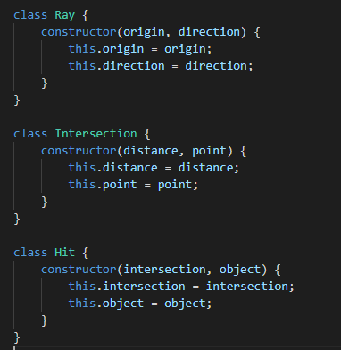
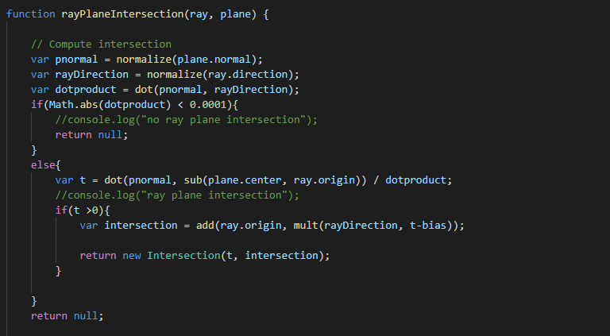
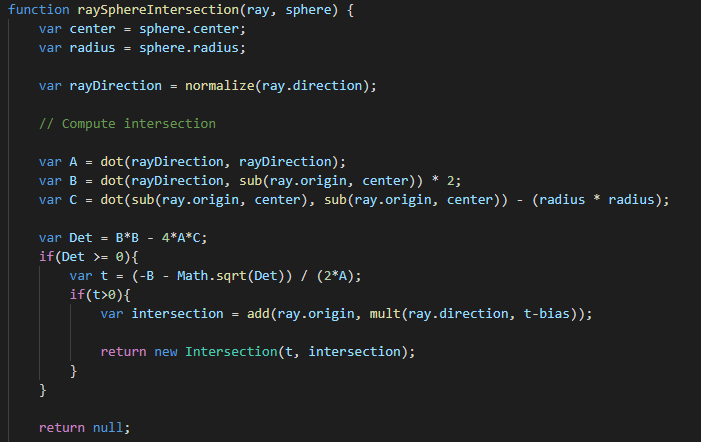
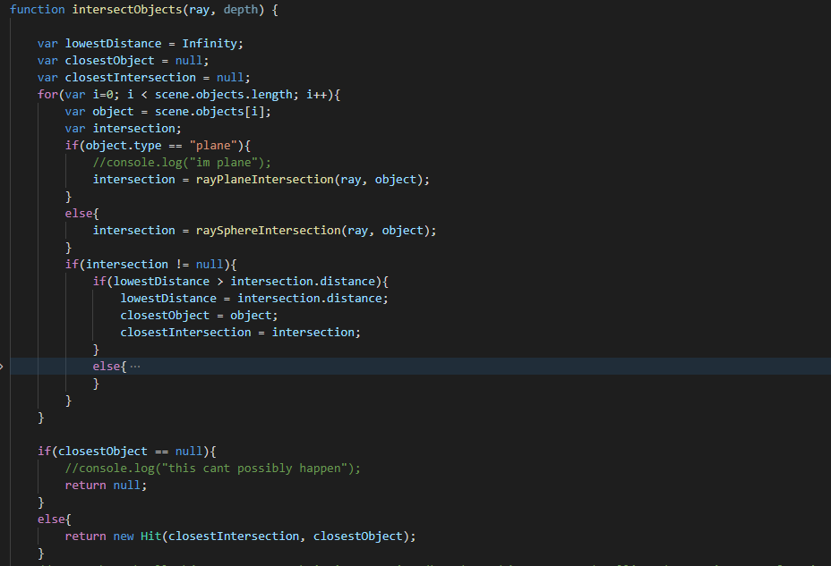
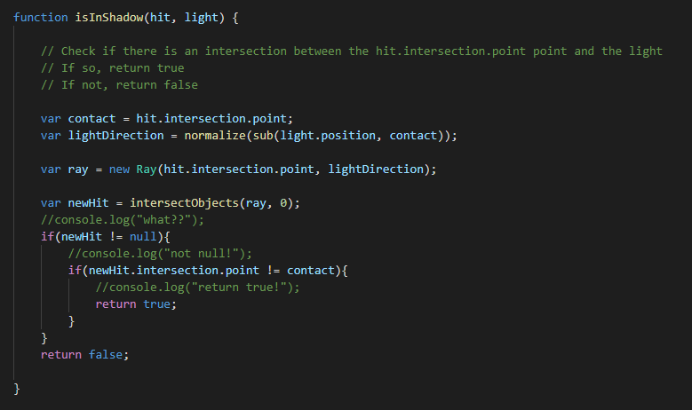
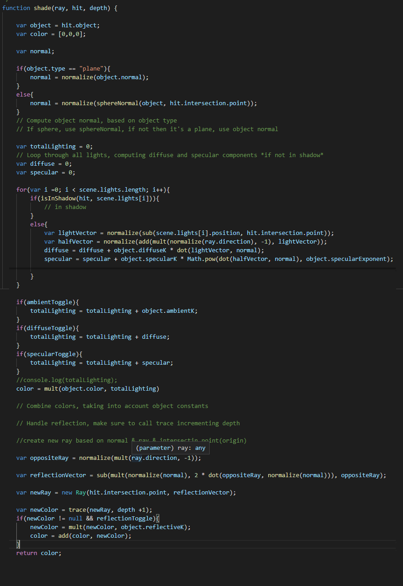

# CS425 - Computer Graphics I (Spring 2021)

## Assignment 3: Ray tracing


### How to use

On your top left corner of the webpage, there should be configuration panel with togglebox for 1.Ambient 2.Diffuse 3.Specular 4.Reflection with Scrollbar maxdepth(from 1 to 5) and Scene upload button and Render Scene button.
The application really starts after user puts Formatted JSON file, using the file input option, then pressing render scene button.
The format of JSON file is :


```javascript
{
    "camera": {
        "position": [0,-5,5],
        "fov": 75,
        "direction": [0,0,0]
    },
    "objects": [
        {
            "center": [0,0,0],
            "normal": [0,-1,0],
            "color": [255,255,255],
            "specularExponent": 1,
            "specularK": 0,
            "ambientK": 0.1,
            "diffuseK": 0.2,
            "reflectiveK": 0.5,
            "type": "plane"
        },
        {
            "center": [0,-1.25,0],
            "radius": 1.25,
            "color": [255,0,0],
            "specularExponent": 1000,
            "specularK": 0.1,
            "ambientK": 0.1,
            "diffuseK": 0.2,
            "reflectiveK": 0.25,
            "type": "sphere"
        }
    ],
    "lights": [
        {
            "position": [-2,-5,0]
        }
    ]
}

```

### Important Code snippets

Rendering of the scene begins with render(element) function.
What render function essentially does, is from the camera point, shoots a ray into specific pixel, calling the trace(ray, depth) function.
Trace function returns the color value of specified pixel, after numorous ray tracing calculations.

## Important Classes



The code makes use of three classes defined.
Ray class defines a ray, with its origin(3d point) and direction(3d vector)

Intersection class defines whenever ray intersects objects, in this programs case, either plane or sphere.
distance denotes the t value in L(t) = e + td representation of the ray, which is basically the distance ray travel from origin to the direction.
point denotes the 3d position of point where the intersection happens.

Hit class defines the first object certain ray intersected on the scene.
Intersection is the above-mentioned intersection class where the first intersection happened, and also object that denotes the object instance that made intersection.

## Important Functions

# The intersection functions




Intersection functions take ray and objects as parameter, and return intersection object if they make intersection. If no intersection is made, returns null.

# The IntersectObjects function



The forementioned intersection functions are to be served in this function.
They are used to take account of all intersection a ray makes with all objects possible.
Then, among the intersection, the closest one (one with lowest distance) will be considered into the Hit object.

# isInShadow function



isInshadow is a boolean function that test whether certain hit object and the point associated with it is shadow-casted by the light parameter.

By shooting a ray from intersection point to the light, and seeing if anything makes intersection, we can tell that there is an object between the point and the light. Therefore, shadow.

# Shade function



Shade, again, assumes that there is a ray, and it has made several intersections already from the IntersectObjects and therefore made a hit.
From there, This sort of work as fragment shader to determine the RGB value of certain pixel.

totalLighting is by default ambient + diffuse + specular. But again, could be modified by user on the configuration panel.

For each light source, we determine whether certain point is in shadow, if not, calculate the diffuse and specular value.

eventually, they are all added to the totalLighting, which will multiply the color by that value. Higher totalLighting will result in brighter and whiter color on the spot.

then for reflection, we calculate new ray from contact point and reflection vector.

This new "reflected" ray will be shot again into the scene with higher depth, using trace function to return a color value. This is the image of whatever will be reflected on the surface.

This image, multiplied by reflectiveK, will be added to the final value.

